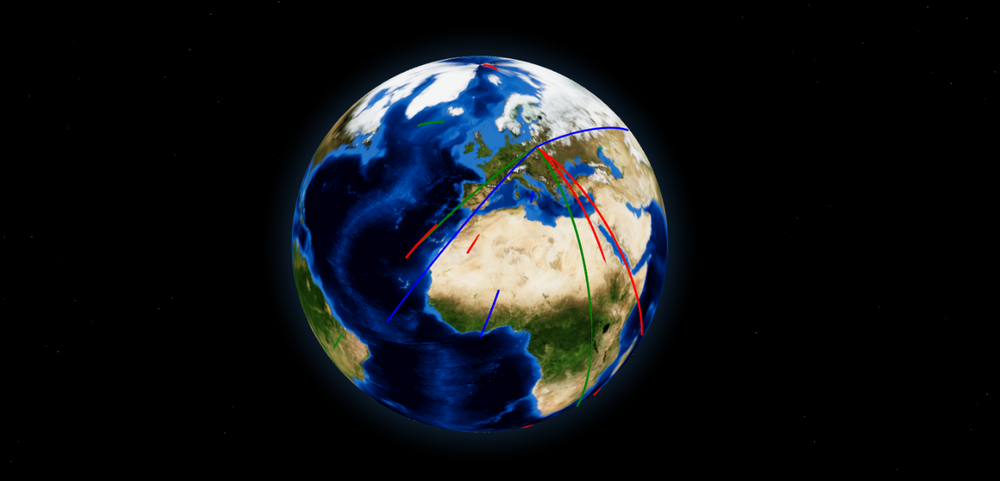

# 🌍 CyberPot – Honeypot Visualization Platform (MVP)

**CyberPot** is a research-focused honeypot platform that collects incoming attack data and visualizes it in real-time on an animated 3D globe. The project aims to deliver a modular, educational-friendly tool that can be used for threat analysis, DevSecOps practice, or public demonstrations of cybersecurity concepts.

---

## 🔥 What It Does

- Listens for unauthorized SSH/Telnet access via **Cowrie**
- Logs attacks and streams parsed metadata via **WebSocket**
- Visualizes attacks as animated arcs between attacker and victim on a **3D globe** using **three-globe**
- Built to be **lightweight**, **hackable**, and **open-source**

---

## 📡 MVP Components

- **Exporter** (Python): parses Cowrie logs and sends attack metadata over WebSocket
- **Frontend** (React + TypeScript + Tailwind): displays Earth texture + animated arcs
- **Globe Visualization**: powered by `three-globe`, using bump + high-res Earth textures
- **Mock Mode**: runs without Cowrie using randomly generated attack coordinates/colors

---

## 🖥️ Architecture

---

## 🛰️ Live Attack Example

---

## ⚠️ Disclaimer

This project is provided **for educational and research purposes only**.  
The authors and contributors take **no responsibility** for any misuse of this software.  
Do not deploy this in environments where it could interfere with production systems or violate legal boundaries.

---

## 🧩 Next Steps (WIP)

- [ ] Cowrie log integration
- [ ] IP geolocation database
- [ ] Grafana dashboard (via Prometheus metrics)
- [ ] Public deployment on Hetzner
- [x] Realtime arc animations per attacker (done ✅)

---
